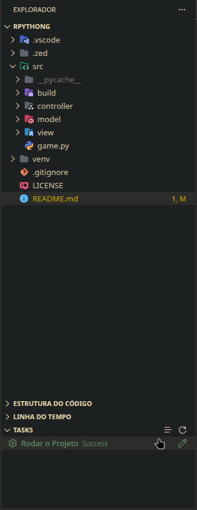
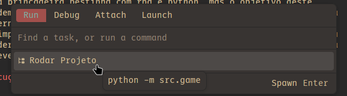

# 🛡️ RPython 🐍

O nome é só uma brincadeira bestinha com rpg e python, mas o objetivo deste
repositório é demonstrar um uso simples de classes em python, sem uso de nenhuma
biblioteca externa, apenas as padrões vindas do python. É um Rpg em turnos
extremamente simplificado, apenas uma orda de inimigos e você escolhe se bate ou
cura, se você derrotar o suficiente você sobe de nível, mas a quantidade de cura
é limitada e deve ser usada com cautela.

## Build e Execução

---

### Vscode

No vscode, a execução é bem direta, existe um arquivo `tasks.json` dentro da
pasta `.vscode` que é responsável por rodar diretamente o projeto, isso serve
para facilitar o comando já que além disso, o projeto tem seu ambiente isolado
no pyenv. Para rodar de maneira mais fácil, recomendo fortemente a instalação da
extensão [Fast Tasks](https://open-vsx.org/vscode/item?itemName=batyan-soft.fast-tasks)
Ou qualquer outra que possua uma função parecida.

Após a innstalação da extensão. Basta ir na aba de arquivos do projeto no
Vscode, e abaixo você verá uma aba nova de tasks. Agora você só precisa clicar
nela e clicar na task de `Rodar o Projeto`.

---

### Zed

No zed a coisa é bem mais simples, basta você abrir o menu de tasks com o `F4`
e ir na aba de `run` após isso já deve aparecer a opção para rodar o projeto:

